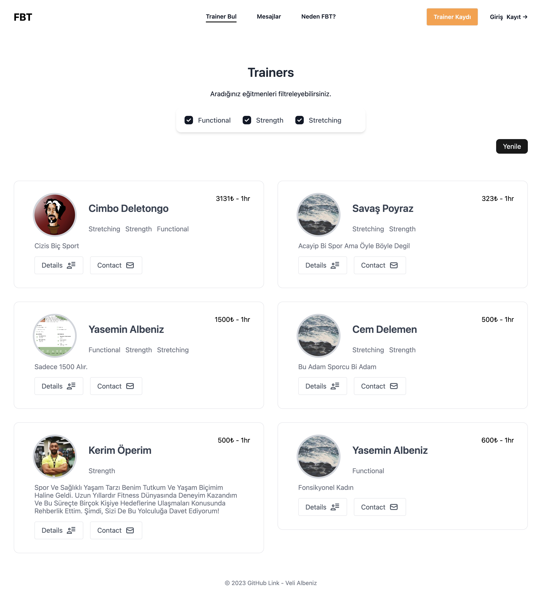
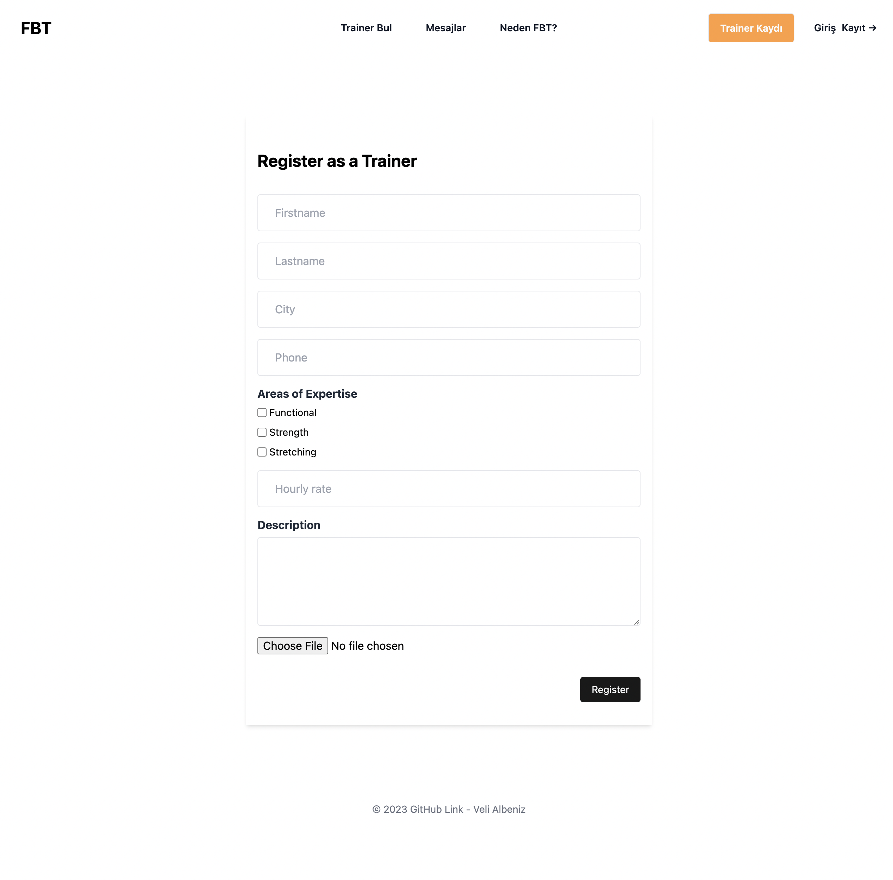
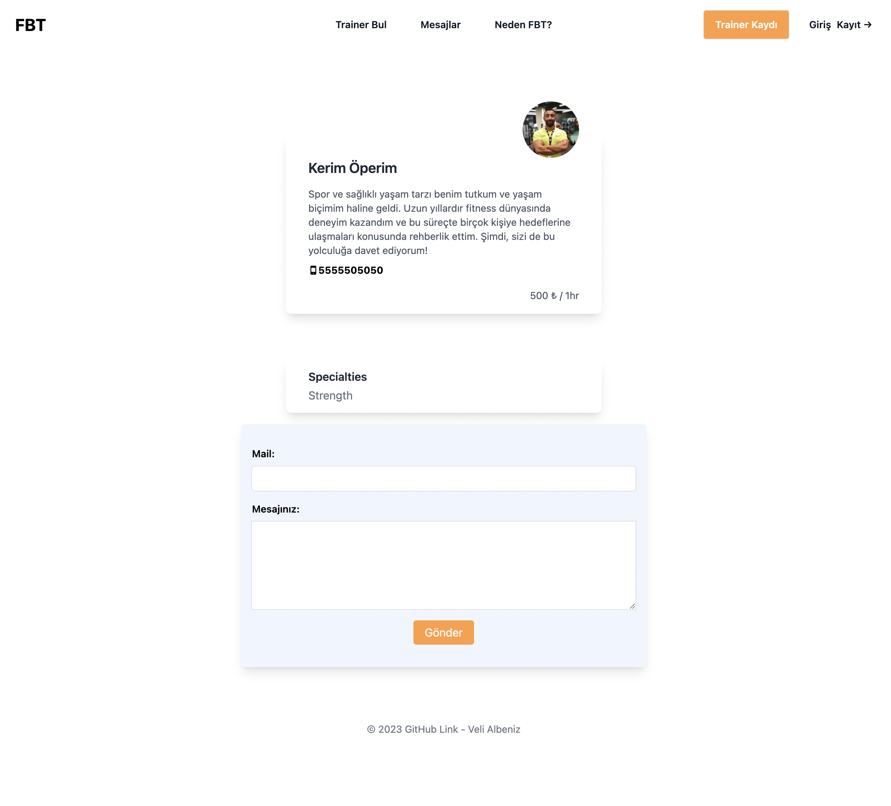
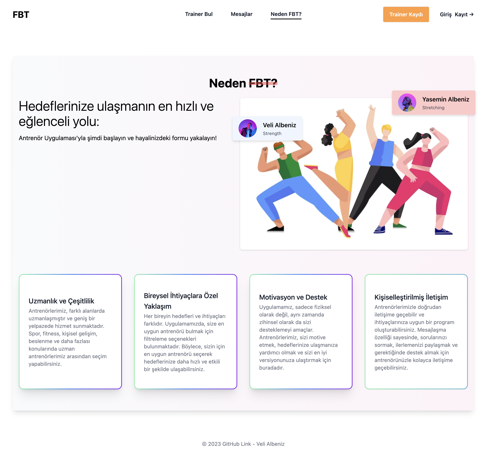

## Built With

* 
* 
* 

## About the Project






## Recommended IDE Setup

[VSCode](https://code.visualstudio.com/) + [Volar](https://marketplace.visualstudio.com/items?itemName=Vue.volar) (and disable Vetur) + [TypeScript Vue Plugin (Volar)](https://marketplace.visualstudio.com/items?itemName=Vue.vscode-typescript-vue-plugin).

## Customize configuration

See [Vite Configuration Reference](https://vitejs.dev/config/).

## Project Setup

```sh
npm install
```

### Compile and Hot-Reload for Development

```sh
npm run dev
```

### Compile and Minify for Production

```sh
npm run build
```

### Code highlights

* Trainer registeration with file input save and validations.
```js
const v$ = useVuelidate(rules, trainerData)

const createTrainer = async () => {
    const result = await v$.value.$validate()

    if(result) {
        const fileInput = document.getElementById('imageFile')
        const file = fileInput.files[0]
        if(!file) {
            errors.img = "Fotoğraf yüklemediniz."
            return
        }

        const maxSize = 250 * 1024
        if(file.size > maxSize) {
            errors.img = "200KB' den küçük fotoğraf seçiniz."
            return
        }

        const storageRef = ref(storage, `images/${trainerData.id}/profilepicture`)

        try {
            await uploadBytes(storageRef, file)
            const imageUrl = await getDownloadURL(storageRef);
            trainerData.imageUrl = imageUrl;

            //other trainerData inputs
            const response = await fetch(`https://vue-trainerapp-default-rtdb.europe-west1.firebasedatabase.app/trainers/${trainerData.id}.json`, {
                    method: 'PUT',
                    body: JSON.stringify(trainerData)
                })
    
                if(!response.ok) {
                    // error
                    alert('Sayfa yüklenirken hata oldu.')
                }
    
            trainerStore.registerTrainer(trainerData)
            router.push('/trainer')

        } catch (error) {
            console.log('error', error)
        }

    } else {
        alert("Eksik veya hatalı kullanıcı girişi.")
    }
}
```

* User registeration with Firebase methods

```js
async register() {
			const auth = getAuth();
			await createUserWithEmailAndPassword(auth, this.email, this.password)
				.then((userCredential) => {
                    const user = userCredential.currentUser
					console.log(user, "succesfully registered");
                    this.isLoggedIn = true
					router.replace("/");
				})
				.catch((error) => {
					console.log("error", error.code);
					this.errorMessage = error.message;
					alert(error.message);
				});
		},
```

* User login with firebase methods

```js
signIn() {
			const auth = getAuth();
			signInWithEmailAndPassword(auth, this.email, this.password)
				.then((data) => {
					const user = data.user;
					this.isLoggedIn = true;
					router.push("/");
				})
				.catch((error) => {
					console.log(error.code);
					switch (error.code) {
						case "auth/invalid-email":
							this.errorMessage = "Invalid email";
							break;
						case "auth/user-not-found":
							this.errorMessage =
								"No account was found with that email";
							break;
						case "auth/wrong-password":
							this.errorMessage = "Incorrect password or email";
							break;
						default:
							this.errorMessage =
								"Email or password was incorrect";
							break;
					}
				});
		},
```